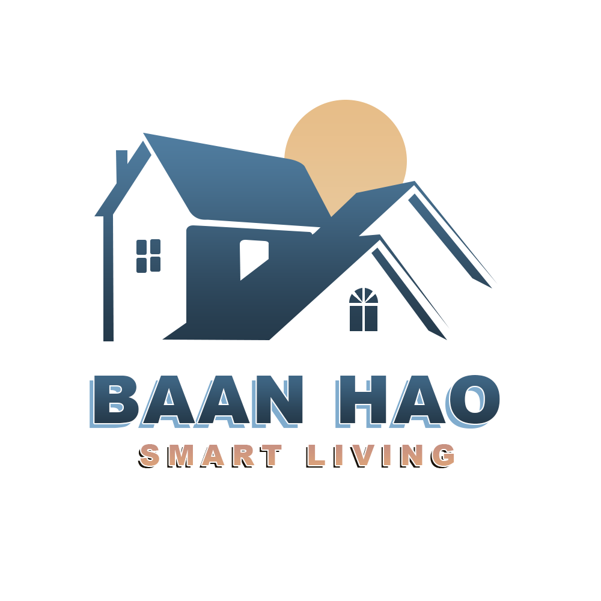

<div align="center">



# **BaanHao: Smart Living Management System**
## **CN332 Object-Oriented Analysis and Design Project**

<div align="left">

---

# Project Overview

BaanHao is a comprehensive property management platform tailored for housing estates and condominiums. It is engineered to optimize the operational efficiency of juristic persons while significantly enhancing the residential experience.

From an administrative standpoint, the platform focuses on streamlining redundant workflows. It resolves persistent issues such as repetitive handling of basic inquiries and the mismanagement of fragmented or unrecorded complaints.

Simultaneously, for residents, BaanHao is designed to eliminate traditional communication barriers, emphasizing seamless accessibility and rapid response times.

---

# Key Features

### For Residents (via LINE Official Account) 
- **Automated FAQ & 24/7 Self-Service:** Instant automated responses for common inquiries such as community rules, outstanding balances, or emergency contacts.

### For Juristic Person (via Web Application)
- **Dashboard:** A central command hub providing a real-time overview of the system's status, recent activities, and key operational metrics at a glance.
- **All Task (Complaint & Maintenance):** A comprehensive task management module categorizing resident complaints and maintenance requests. Staff can track progress, update ticket statuses, and manage workflows efficiently.
- **Notice:** An announcement management system allowing staff to create, edit, and broadcast important community notices directly to residents.
- **Event:** A feature to organize, schedule, and promote community events or activities to encourage resident engagement.
- **Staff:** A role and account management system for juristic personnel, enabling administrators to control access levels and staff responsibilities securely.
- **Analytics:** In-depth data visualization and reporting tools that analyze task resolution times, frequent issues, and overall operational efficiency to aid in data-driven decision-making.

---

# Technical Stack

### Frontend (Juristic Web Application)
- **Core Languages:**  

### Backend & API
- **Framework:**  
- **Messaging API:**  

### Database
- **Relational Database:** 

### Tools & Management
- **Design & Prototyping:**  
- **Version Control:** 
- **Project Management:**  

---

| Project Progress | Doc & Slides | Presentation Date |
|---|---|---|
| **Week 1: Concept** | [📄 Concept Paper](Documents/Iteration1/hm1_CONCEPT_PAPER.pdf) <br> [📊 Iteration 1 Slides](Documents/Iteration1/iteration1-BaanHao.pdf) |-|
| **Week 2: Requirements** | [📄 การแจกแจง Requirement](Documents/Iteration2/hm2_การแจกแจงrequirement.pdf) <br> [📊 Iteration 2 Slides](Documents/Iteration2/iteration2-BaanHao.pdf) |-|
| **Week 3: Development** | [🎨 Canva Link](https://www.canva.com/design/DAG-12vJwHI/FFv4AjDZGIT0hqmoKelIXQ/view?utm_content=DAG-12vJwHI&utm_campaign=designshare&utm_medium=link2&utm_source=uniquelinks&utlId=h50f6ef177b) <br> [📊 Iteration 3 Slides](Documents/Iteration3/Iteration3_BannHao.pdf) | 26/01/2026 |
| **Week 4: UX/UI Demo** | [🎥 GUI Website Walkthrough](https://youtu.be/igLxI9eYJGI?si=iCysm1rsU2UA-4bB) <br> [📱 Line OA Short Demo](https://youtube.com/shorts/j89uEZ3Yu6c?feature=share) |-|
| **Week 5: Facade Pattern in project** | [📊 Iteration 5 Slides](https://www.canva.com/design/DAHAvvavFFM/HOUiDaKPhY2ek7LEpf9VWA/view?utm_content=DAHAvvavFFM&utm_campaign=designshare&utm_medium=link2&utm_source=uniquelinks&utlId=he9fad04ba6) |-|
| **Week 6: Log in interface** | [📊 Iteration 6 Slides](https://www.canva.com/design/DAHBRznlkXk/oznuqUfk21gcsGM5xwXzZg/edit?utm_content=DAHBRznlkXk&utm_campaign=designshare&utm_medium=link2&utm_source=sharebutton) |-|
| **Week 7: Implement plan** | [📊 Iteration 7 Slides](https://www.canva.com/design/DAHDLQnATVE/9BKB05CxdQyN2q5MyVqCfg/edit?utm_content=DAHDLQnATVE&utm_campaign=designshare&utm_medium=link2&utm_source=sharebutton) |-|
| **Week 8 -  9: Development** | - |-|
| **Week 10 -  11: Development** | - |-|
| **Week 12 - Final: Testing and Final** | - |-|

---

## Instructor Feedback Log

> [!IMPORTANT]
> **Date: 26/01/2026 (Iteration 1-3)**
> - **Comment:** ให้ดูตัวอย่างการสืบทอด Class (Inheritance) ที่ยืดหยุ่นมากขึ้น เพื่อให้ Code Clean และจัดการ Logic ได้ง่ายขึ้น

---

## Team Members

| Student ID | Name | Roles |
| :---: | :--- | :--- |
| `6710615292` | athiphat sunsit | Project Manager, Front-end, Back-end, QA |
| `6710615060` | โชติวิชช์ ดังสะท้าน | Front-end |
| `6710615185` | ภูริช อัมพะวา | Front-end, Back-end |
| `6710545010` | นพัตธีรา เหลาเกิ้มหุ่ง | Front-end |
| `6710615144` | ปณิธาน ตันตื้อ | Front-end |
| `6710685055` | พัชรพล มาลัยศรี | Back-end, QA |
| `6710685014` | ธีภพ รัตนทรัพย์ศิริ | Back-end |

---

# Software Design Artifacts

### 1. System Modeling (UML Diagrams)
* **Use Case Diagram:** `empty` 
* **Class Diagram:** `empty` 

### 2. Database Design
* **Entity Relationship Diagram (ERD):** `empty` 

### 3. User Interface (UI) & User Experience (UX)
* **System Wireframes & Mockups:** `empty`

---

# Installation

### Prerequisites 
- **Git**
- **Terminal**

### Step-by-Step Installation

**1. Clone the repository:**
```bash
git clone [https://github.com/theepop66/CN332-group-project.git](https://github.com/theepop66/CN332-group-project.git) CN332
cd CN332/myproject
```

**2. Create and activate a virtual environment:**
```bash
# For Windows
python -m venv venv
venv\Scripts\activate

# For macOS/Linux
python3 -m venv venv

source venv/bin/activate
```

**3. Install dependencies:**
```bash
pip install -r requirements.txt
```

**4. Environment Variables Setup:**
```bash
# about .env file. Let talk to Back-end Team :)
```

**5. Database Setup & Migration:**
```bash
# about database file. Let talk to Back-end Team :)
```

**6. Run the development server:**
```bash
python manage.py runserver

# Note: When you run server successfully, you can click http://127.0.0.1:8000/ to use the web application.
```

**6. Test Account :**
```bash
Name : admin
Password : admin12345
```
---

# Project Structure
```markdown
CN332-group-project/              # Root directory of the project
├── BannHao_CLI/                  # Command Line Interface module (if applicable)
├── Documents/                    # All project documentation and assets
│   ├── Database_Diagram/         # Database design files (e.g., ER Diagram)
│   ├── Iteration1/               # Documents and presentation slides for Week 1
│   ├── Iteration2/               # Documents and presentation slides for Week 2
│   ├── Iteration3/               # Documents and presentation slides for Week 3
│   ├── Iteration4/               # Documents and presentation slides for Week 4
│   └── LOGO/                     # Project logo image files
├── myproject/                    # Main development folder (Source Code)
│   ├── baanhao_project/          # Main Django project directory containing all apps
│   │   ├── analytics/            # Django App: Data processing and statistics
│   │   ├── baanhao_project/      # Django core configuration (settings.py, urls.py)
│   │   ├── complaints/           # Django App: Resident complaint management
│   │   ├── dashboard/            # Django App: Juristic admin dashboard UI/Logic
│   │   ├── issues/               # Django App: General issues and ticketing system
│   │   ├── maintenance/          # Django App: Maintenance request management
│   │   ├── media/profile_images/ # Directory for user-uploaded media (e.g., profile pics)
│   │   ├── notifications/        # Django App: Notification system & LINE API integration
│   │   ├── profile_images/       # (Fallback/Default directory for profile pictures)
│   │   ├── properties/           # Django App: Property and asset management
│   │   ├── static/               # Directory for static files (CSS, JavaScript, Images)
│   │   ├── templates/            # Directory for HTML templates (Frontend UI)
│   │   ├── users/                # Django App: User management, authentication, and roles
│   │   ├── .env.example          # Template for environment variables (e.g., DB credentials)
│   │   ├── db.sqlite3            # Default SQLite database for local development
│   │   └── manage.py             # Django command-line utility (runserver, migrate, etc.)
│   ├── .gitignore                # Git ignore file for the source code level (e.g., venv)
│   └── requirements.txt          # Python dependencies list (e.g., django, psycopg2)
├── .gitignore                    # Root level Git ignore file
└── README.md                     # The main project documentation file (this file)
```


