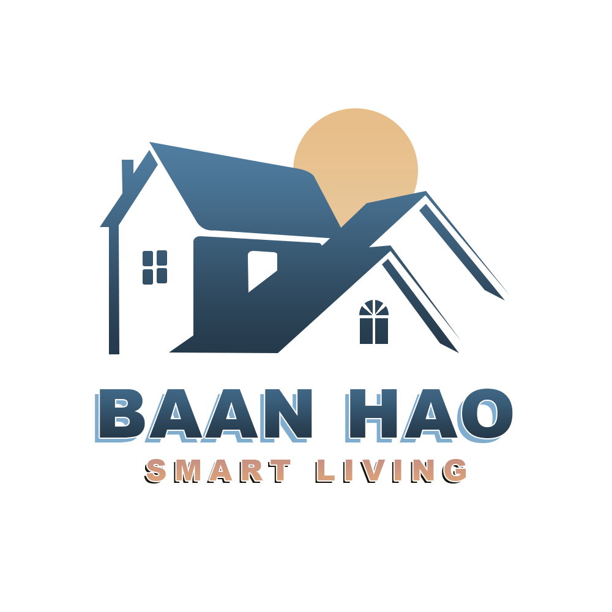

## **BaanHao: Smart Living Management System**
## **CN332 Object-Oriented Analysis and Design Project**

---

## Project Overview

BaanHao(บ้านเฮา) is a comprehensive property management platform tailored for housing estates and condominiums. It is engineered to optimize the operational efficiency of juristic persons while significantly enhancing the residential experience.

From an administrative standpoint, the platform focuses on streamlining redundant workflows. It resolves persistent issues such as repetitive handling of basic inquiries and the mismanagement of fragmented or unrecorded complaints.

Simultaneously, for residents, BaanHao is designed to eliminate traditional communication barriers, emphasizing seamless accessibility and rapid response times.

---

## Key Features

### For Residents (via LINE Official Account) 
- **Automated FAQ & 24/7 Self-Service:** Instant automated responses for common inquiries such as community rules, outstanding balances, or emergency contacts.

### For Juristic Person (via Web Application)
- **Dashboard:** A central command hub providing a real-time overview of the system's status, recent activities, and key operational metrics at a glance.
- **All Task (Complaint & Maintenance):** A comprehensive task management module categorizing resident complaints and maintenance requests. Staff can track progress, update ticket statuses, and manage workflows efficiently.
- **Notice:** An announcement management system allowing staff to create, edit, and broadcast important community notices directly to residents.
- **Event:** A feature to organize, schedule, and promote community events or activities to encourage resident engagement.
- **Staff:** A role and account management system for juristic personnel, enabling administrators to control access levels and staff responsibilities securely.
- **Analytics:** In-depth data visualization and reporting tools that analyze task resolution times, frequent issues, and overall operational efficiency to aid in data-driven decision-making.
---

## 🚀 Project Progess

### Week 1: Concept
- **Documentation:** [📄 Concept Paper](Documents/Iteration1/hm1_CONCEPT_PAPER.pdf)
- **Presentation:** [📊 Iteration 1 Slides](Documents/Iteration1/iteration1-BaanHao.pdf)

### Week 2: Requirements
- **Documentation:** [📄 การแจกแจง Requirement](Documents/Iteration2/hm2_การแจกแจงrequirement.pdf)
- **Presentation:** [📊 Iteration 2 Slides](Documents/Iteration2/iteration2-BaanHao.pdf)

### Week 3: Development
- **Design Tool:** [🎨 Canva Link](https://www.canva.com/design/DAG-12vJwHI/FFv4AjDZGIT0hqmoKelIXQ/view?utm_content=DAG-12vJwHI&utm_campaign=designshare&utm_medium=link2&utm_source=uniquelinks&utlId=h50f6ef177b)
- **Presentation:** [📊 Iteration 3 Slides](Documents/Iteration3/Iteration3_BannHao.pdf)

### Week 4: UX/UI Demo
- **GUI Website:** [🎥 Walkthrough Video](https://youtu.be/igLxI9eYJGI?si=iCysm1rsU2UA-4bB)
- **Line OA:** [📱 Short Demo Video](https://youtube.com/shorts/j89uEZ3Yu6c?feature=share)

### Week 5: Facade Pattern in project
- **Presentation:** [Iteration 5 Slides](https://www.canva.com/design/DAHAvvavFFM/HOUiDaKPhY2ek7LEpf9VWA/view?utm_content=DAHAvvavFFM&utm_campaign=designshare&utm_medium=link2&utm_source=uniquelinks&utlId=he9fad04ba6)

### Week 6: Log in interface
- **Presentation:** [Iteration 6 Slides](https://www.canva.com/design/DAHBRznlkXk/oznuqUfk21gcsGM5xwXzZg/edit?utm_content=DAHBRznlkXk&utm_campaign=designshare&utm_medium=link2&utm_source=sharebutton)

### Week 7: Implement plan
- **Presentation:** [Iteration 7 Slides](https://www.canva.com/design/DAHDLQnATVE/9BKB05CxdQyN2q5MyVqCfg/edit?utm_content=DAHDLQnATVE&utm_campaign=designshare&utm_medium=link2&utm_source=sharebutton)
---

## 📝 Instructor Feedback Log

> [!IMPORTANT]
> **Date: 26/01/2026 (Iteration 1-3)**
> - **Comment:** ให้ดูตัวอย่างการสืบทอด Class (Inheritance) ที่ยืดหยุ่นมากขึ้น เพื่อให้ Code Clean และจัดการ Logic ได้ง่ายขึ้น

---
*Last Updated: 2026-02-08*

---

## 👥 สมาชิกในกลุ่มและหน้าที่รับผิดชอบ (Team Members & Roles)

### 1. Project Manager (PM)
**หน้าที่รับผิดชอบ:** วางแผนและบริหารจัดการโปรเจกต์ ดูแลภาพรวม ติดตามความคืบหน้า และประสานงานระหว่างสมาชิกในทีมเพื่อให้งานสำเร็จตามเป้าหมายและระยะเวลาที่กำหนด

| รหัสนักศึกษา | ชื่อ-นามสกุล |
| :---: | :--- |
| `6710615292` | อธิภัทร ศูนย์สิทธิ์ |

### 2. Front-end Development
**หน้าที่รับผิดชอบ:** พัฒนาส่วนส่วนติดต่อผู้ใช้งาน (User Interface) ที่ผู้ใช้งานมองเห็นและโต้ตอบได้โดยตรง เน้นการสร้างประสบการณ์การใช้งานที่ดี (UX/UI) และเชื่อมต่อข้อมูลกับระบบหลังบ้าน

| รหัสนักศึกษา | ชื่อ-นามสกุล |
| :---: | :--- |
| `6710615060` | โชติวิชช์ ดังสะท้าน |
| `6710615185` | ภูริช อัมพะวา |
| `6710545010` | นพัตธีรา เหลาเกิ้มหุ่ง |
| `6710615144` | ปณิธาน ตันตื้อ |
| `6710615292` | อธิภัทร ศูนย์สิทธิ์ |

### 3. Back-end Development
**หน้าที่รับผิดชอบ:** พัฒนาระบบหลังบ้าน (Server-side) จัดการฐานข้อมูล (Database) สร้าง API และดูแลลอจิกการทำงานหลักของแอปพลิเคชันให้ทำงานได้อย่างถูกต้อง ปลอดภัย และมีประสิทธิภาพ

| รหัสนักศึกษา | ชื่อ-นามสกุล |
| :---: | :--- |
| `6710615185` | ภูริช อัมพะวา |
| `6710685055` | พัชรพล มาลัยศรี |
| `6710685014` | ธีภพ รัตนทรัพย์ศิริ |
| `6710615292` | อธิภัทร ศูนย์สิทธิ์ |

### 4. Testing / Quality Assurance
**หน้าที่รับผิดชอบ:** ทดสอบการทำงานของระบบ ค้นหาข้อผิดพลาด (Bugs) และตรวจสอบความถูกต้องของฟีเจอร์ต่างๆ เพื่อให้มั่นใจว่าซอฟต์แวร์ได้มาตรฐานก่อนนำไปใช้งานจริง

| รหัสนักศึกษา | ชื่อ-นามสกุล |
| :---: | :--- |
| `6710685055` | พัชรพล มาลัยศรี |
| `6710615292` | อธิภัทร ศูนย์สิทธิ์ |
